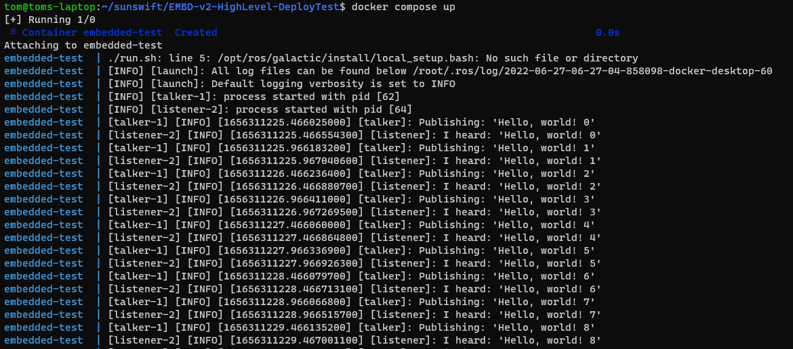

# Embedded v2 Deployment Test
This repo is intended to give a sample ros package. It implements a simple talker/listener set of nodes based on the tutorial [here](https://docs.ros.org/en/galactic/Tutorials/Beginner-Client-Libraries/Writing-A-Simple-Cpp-Publisher-And-Subscriber.html)

## How to run
```
docker-compose up --build
```
> On some systems, use `docker compose up --build`

Note; using `--build` forces the image to re-build from any changes

## What is correct

The following image shows the output from the docker container when working correctly.

